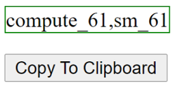

# mygpu

Obtain CUDA compute capability information for the locally installed Nvidia GPU, from browser. The compute capability is generally required as input for projects that use CUDA builds.

# Table of contents
1. [Requirements](#reqs)
2. [Getting](#howto)
3. [Using](#usage)
4. [Bugs](#unlisted)
5. [References](#references)
6. [Disclaimer](#disclaimer)

## Requirements <a name="reqs"></a>

- WebGL supported browser

On Edge canary, sometimes, the Vulkan backend is used making the Nvidia driver invisible. Using the option "--use-angle=d3d11on12" is a remedy (2023).

- Nvidia GPU and recent drivers

### Note

- On Hybrid systems/ notebooks with multiple GPUs, force application to use Nvidia GPU - Refer https://alteredqualia.com/texts/optimus/ 

- On Tegra systems, Chrome seems to be using SwiftShader by default, so perform the manual step of identification (#manual)


## How to get CUDA compute capability <a name="howto"></a>

### Browser <a name="browser"></a>

Browse to one of the below links - 

https://gpupowered.org/mygpu/

Or 

https://prabindh.github.io/mygpu/

The CUDA compute information will be displayed in the same page



### Manually <a name="manual"></a>

`nvidia-smi --query-gpu=compute_cap --format=csv`

Or, Obtain the name of the GPU by running below command on command line

`nvidia-smi --query-gpu=name --format=csv`

Then use this json file to find the compute capability

https://github.com/prabindh/mygpu/blob/main/mygpu.json

## Using this information <a name="usage"></a>

### In Makefiles <a name="makefiles"></a>

Enter only the compute_xx string obtained above, in the `arch=` and `code=` fields below

````
ARCH= -gencode arch=compute_xx,code=compute_xx
$(OBJDIR)%.o: %.cu $(DEPS)
    $(NVCC) $(ARCH) $(COMMON) --compiler-options "$(CFLAGS)" -c $< -o $@
````

### In Visual Studio (For CUDA Runtime Project Type only) <a name="vstudio"></a>

Enter the complete string obtained above, in this field

`Configuration Properties --> CUDA C/C++ --> Device --> Code Generation` --> compute_xx,sm_xx

## Bug/Unlisted GPU <a name="unlisted"></a>

- File an issue at https://github.com/prabindh/mygpu

## References <a name="references"></a>

- https://patrickorcl.medium.com/compile-with-nvcc-3566fbdfdbf

- https://arnon.dk/matching-sm-architectures-arch-and-gencode-for-various-nvidia-cards/

- https://privacycheck.sec.lrz.de/active/fp_wg/fp_webgl.html

- https://github.com/timvanscherpenzeel/detect-gpu

- https://docs.nvidia.com/cuda/cuda-compiler-driver-nvcc/index.html

## Disclaimer <a name="disclaimer"></a>

Author or contributors not responsible for any direct, indirect, or consequential loss or damage resulting from any usage of this data. 

This is not an official Nvidia product.

Sourced from public material at https://en.wikipedia.org/wiki/CUDA and https://developer.nvidia.com/cuda-gpus#compute. 

Only covers GPUs with CUDA compute capability > 5.0. For ex, these are not listed (GeForce GTX 680,GTX 590,GTX 580,GTX 570,GTX 560 Ti,GTX 560,GT 440,GTX 480,GTX 470,GTX 465,GTX 295,GTX 280/GTX 285,GTX 260,210,GT 240,GT 220,GT 130,GT 120,GTS 250,9800 GX2,9800 GTX,9800 GT,9600 GSO,9600 GT,8800 GTX/Ultra,8800 GT,8800 GTS,8600 GT/GTS,8400 GS/GT)